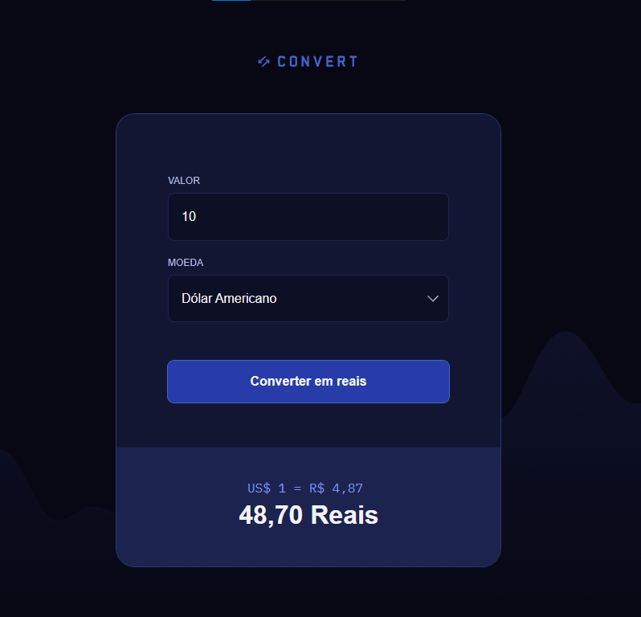

# 💱 Conversor de Moedas

Um projeto simples de conversor de moedas (USD, EUR, GBP para BRL) feito em HTML, CSS e JavaScript puro. O foco está na funcionalidade e no design simples e responsivo.

  

---

## Tecnologias Utilizadas 📎

Este projeto foi desenvolvido com as seguintes tecnologias:

- [HTML5](https://developer.mozilla.org/pt-BR/docs/Web/HTML)  
- [CSS3](https://developer.mozilla.org/pt-BR/docs/Web/CSS)  
- [JavaScript](https://developer.mozilla.org/pt-BR/docs/Web/JavaScript)  

---

## Estrutura do Projeto 📂

📦 convert-template-main/  
├── 📄 index.html        → Estrutura da página  
├── 🎨 style.css         → Estilos do site  
├── ⚙️ script.js         → Lógica de conversão  
├── 📁 img/              → Pasta com imagens  
│   └── 🖼️ image.png     → Imagem de demonstração  
└── 📝 README.md         → Documentação do projeto  

---

## Resultado 📷

    

